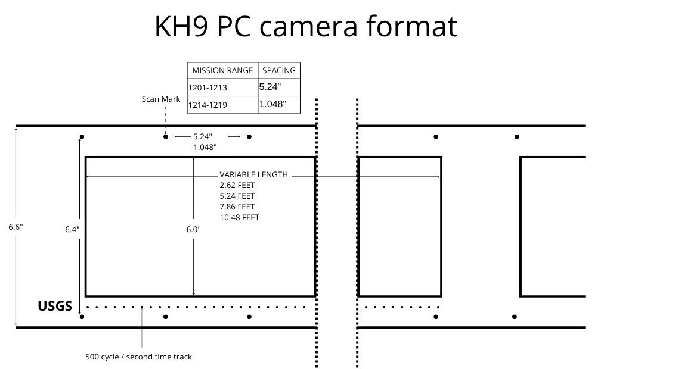
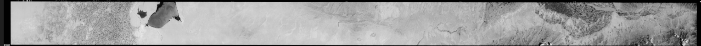
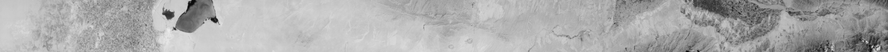
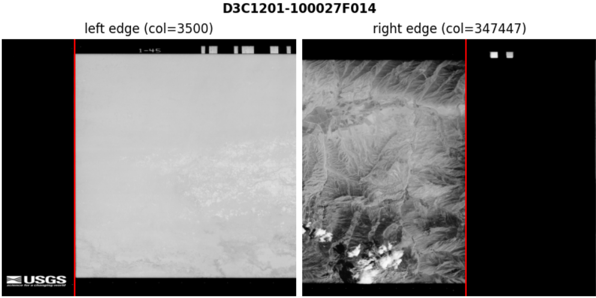
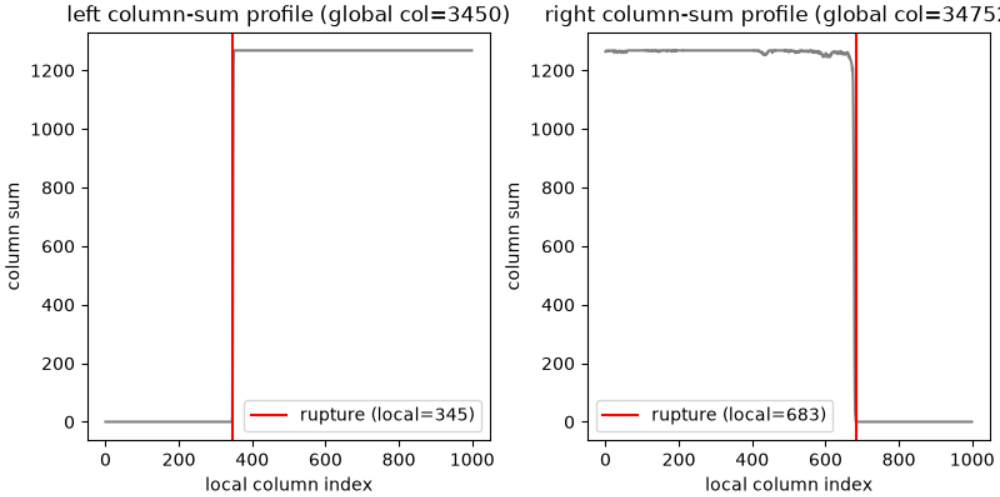
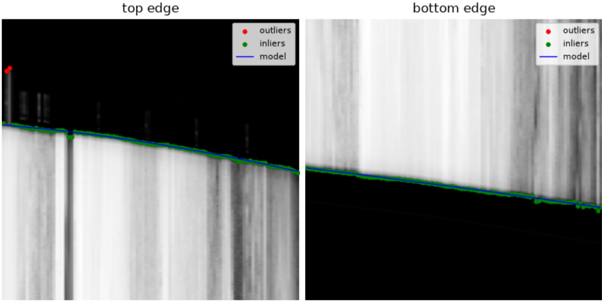
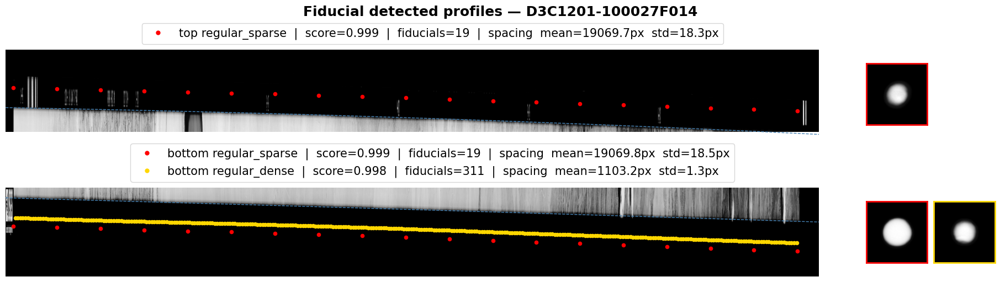
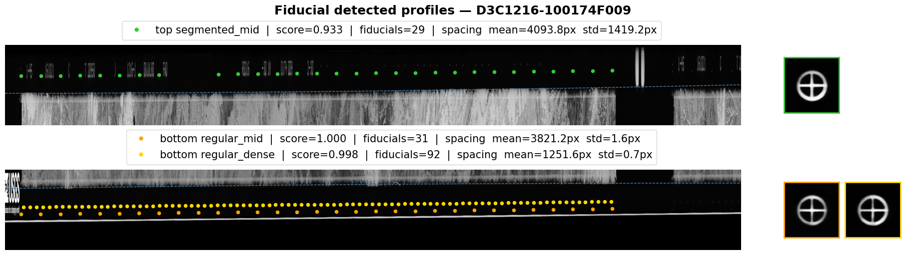
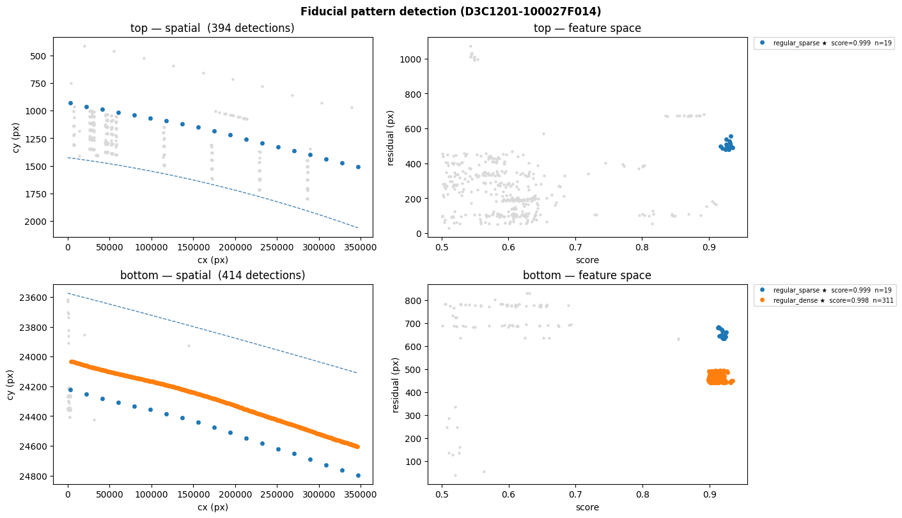

# Preprocessing of KH-9 Hexagon Panoramic Camera Imagery

## Introduction

This document describes the preprocessing pipeline applied to KH-9 Hexagon panoramic camera scans. Raw scans are delivered as several overlapping tif tiles per image. The pipeline stitches these tiles into a single mosaic, then corrects the geometric distortions introduced by the scanning process (shear, curved edges) using the film's fiducial marks, producing a single restituted image ready for photogrammetric processing (Structure from Motion).

### Camera format

The physical layout of the KH-9 PC negative drives most of the constants used during restitution (see the [official NRO documentation](https://www.nro.gov/Portals/65/documents/foia/declass/ForAll/101917/F-2017-00094b.pdf), figure 5, for the reference fiducial marker layout). At the nominal scan resolution of 0.007 mm/px (px = inches × 25.4 / 0.007):
- spacing between scan (fiducial) marks: 5.24" (19014 px) for missions 1201–1213, 1.048" (3803 px) for missions 1214–1219;
- frame width, in four nominal lengths: 2.62 ft (114082 px), 5.24 ft (228165 px), 7.86 ft (342247 px), 10.48 ft (456329 px);
- vertical spacing between the top and bottom fiducial rows: 6.4" (23222 px), around a 6.0" (21771 px) effective image height.

### Input data

The pipeline accepts two kinds of input:
- a `.tgz` archive containing all the tif tiles for one image, extracted before processing;
- a list of individual tif tile paths, already extracted.

In both cases, tiles must be named `{entity_id}_<suffix>.tif` (e.g. `{entity_id}_a.tif`, `{entity_id}_b.tif`, ...), where `entity_id` is everything before the first underscore. The suffix itself is not validated — tiles are simply sorted case-insensitively by filename to determine their left-to-right order for mosaicking, so any suffix that sorts correctly works.

## 1. Mosaic images

- **Input:** list of tiles with proper naming
- **Output:** joined tif image
- **Goal:** join all tiles into a single tif image

For each pair of neighboring tiles, we take an overlap window of 3000 px on the right edge of image A and the left edge of image B, split this window into horizontal blocks of 512 px, and match ORB keypoints between the two blocks. We then fit a Euclidean transform to these matches with RANSAC. This is repeated sequentially along the whole sequence (A-B, B-C, ...), composing each new transform with the previous ones so that every tile ends up in the same coordinate system as the first tile. Finally, all tiles are remapped onto a single canvas using `WarpedVRT`. Note that the first tile is never transformed, so alignment errors and shear accumulate as we move further from it.

*Joined image straight out of the mosaicking step — shear accumulates from left to right as it moves away from the (untransformed) first tile.*

## 2. Restitution

- **Input:** joined tif image
- **Output:** restituted image
- **Goal:** correct the accumulated alignment errors and shear, and crop the image to the area of interest

Detect the top and bottom [fiducial marks](#23-detect-top-and-bottom-fiducial-marks) and use their positions as source points. Compute the matching destination points from the theoretical horizontal spacing between fiducials and the theoretical vertical spacing between the top and bottom rows. From these source/destination pairs, fit a Thin Plate Spline transform and apply it to the image. The crop is then centered on the transformed image, using the expected final width and height for the mission.

*The same image after restitution: shear corrected and cropped to the area of interest.*

### 2.1 Detect left and right edges

This detector runs first and provides the horizontal bounds reused by the other restitution steps ([2.2](#22-detect-top-and-bottom-edges), [2.3](#23-detect-top-and-bottom-fiducial-marks)). For each side, a vertical band is read, cropped top and bottom by 25% of the image height to avoid the fiducial areas, and downsampled to a single-row intensity profile (1% of the window width by default) for speed. The left window spans from column 0 up to `src.width - expected_width`, i.e. the full range in which the left edge could physically sit given the mission's expected image width (from `KH9ImageSpec`), and is searched once. Once the left edge is found, the right window is opened once, a fixed width (10000 px by default) centered on the left edge position plus the expected image width, rather than scanning the whole image — this keeps the detection fast and avoids catching the wrong frame boundary. For the right side, the profile is reversed before processing so both sides are treated the same way, scanning from the film background outward into the image content.

Within each profile, the longest contiguous segment sitting at the signal's minimum value is taken as the background/leader plateau — the film leader, i.e. the blank film area outside the image frame, uniformly dark. Starting right after that plateau, the profile's gradient is scanned forward for the first rise that crosses a threshold (a fraction of the profile's peak gradient, 0.3 by default); the scan keeps climbing while the gradient keeps increasing, so it lands on the peak of the rise rather than its first crossing. That peak marks the transition from background to image content and is taken as the edge position, with the peak-to-max gradient ratio kept as a rough confidence score.

If either side fails to cross the gradient threshold, detection aborts immediately.

*Detected left and right edge column (red line) on cropped thumbnails around each side.*

*Downsampled intensity profile used to locate each edge: the background plateau (minimum, constant) followed by the gradient rise into image content, whose peak marks the edge.*

### 2.2 Detect top and bottom edges

For each side, a horizontal band is extracted, spanning the left/right image bounds found in [2.1](#21-detect-left-and-right-edges). Its height is the margin between the raster height and the mission's expected effective image height (from `KH9ImageSpec`), so the band always reaches from the film leader well into the image content regardless of mission format. This band is downsampled onto a grid of columns, and for each column the intensity profile is scanned for the point where it first drops below a background threshold — the film leader outside the image. That threshold crossing is kept directly as the "rupture" marking the edge at that column. The scan direction is chosen so both edges are found from the image side outward: upward for the top band, downward for the bottom band.

The rupture points collected across all sampled columns are fit with a RANSAC polynomial (degree 2 by default) per edge. RANSAC keeps the fit robust to outlier ruptures caused by scratches, dust, or other scanning artifacts. Fit quality is then checked by comparing the two fitted models against each other: the mean vertical gap between the top and bottom curves is compared to the mission's expected effective height (from `KH9ImageSpec`), and the gap's standard deviation across the width is also checked — a large relative error or a large spread flags the detection as unreliable (see [2.4](#24-failure-handling)).

*Detected ruptures along the top and bottom bands, with RANSAC inliers/outliers and the fitted degree-2 polynomial model.*

The fitted top and bottom polynomial models are not applied on their own — they are used as the reference top/bottom edges that bound the vertical search window for the fiducial detection in [2.3](#23-detect-top-and-bottom-fiducial-marks).

### 2.3 Detect top and bottom fiducial marks

For each side (top and bottom), a set of overlapping horizontal blocks is scanned across the image width, from the left film margin (column 0) to the right edge found in [2.1](#21-detect-left-and-right-edges). Within each block, multi-template matching looks for the known fiducial marker shapes (disk or wagon-wheel, depending on the mission) in the band between the block and the predicted top/bottom edge from [2.2](#22-detect-top-and-bottom-edges). Detections from all blocks are merged and de-duplicated with non-maximum suppression.

*Disk fiducials detected along the top and bottom bands (missions 1201–1213), color-coded by pattern, with mean patch inset on the right.*

*Wagon-wheel fiducials detected on a mission using the other marker shape (1214–1219), also with multiple valid patterns per side.*

Not every detected blob is a real fiducial mark — template matching also produces false positives on film texture and noise. To separate real detections from these, each detection is described by two features: its template matching score, and its vertical residual to the top/bottom edge model fitted in [2.2](#22-detect-top-and-bottom-edges) (genuine fiducials sit close to this line, unlike most false positives). These two features are standardized and clustered with DBSCAN, so that detections that look alike are grouped together and inconsistent ones are left as noise.

*Left: detections in image space (gray = unmatched) with the fitted top/bottom edge model overlaid. Right: the same detections in feature space (matching score vs. residual to the edge), where valid patterns separate from the noise cloud.*

A mission can present several fiducial patterns on the same side (e.g. sparse, mid, dense), each with its own known spacing, so the clustering is repeated over a grid search: 20 values of the DBSCAN neighborhood radius (eps) combined with 20 relative weights applied to the residual feature (from 0.5 to 5 times the matching score). For every combination, each resulting cluster is compared against every candidate pattern for that side by checking whether the spacing between consecutive points matches the pattern's known spacing, then scoring it on spacing regularity and on how much of the image width it covers. The best-scoring cluster found across the whole grid search is kept for each pattern, and the best pattern on each side is used as the source points for the restitution.

### 2.4 Failure handling

Each detector in the restitution chain can fail independently:

- **Left/right edges** ([2.1](#21-detect-left-and-right-edges)): the left edge is searched once, in a window spanning its full possible range given the mission's expected width. The right edge is then searched once, in a window centered on the left edge plus the expected width. Neither side is retried — if either fails, fitting aborts immediately with an exception — every other detector depends on these bounds.
- **Top/bottom edges** ([2.2](#22-detect-top-and-bottom-edges)): a side with no rupture points at all aborts fitting. Otherwise, the fitted top/bottom models are only flagged as unreliable if the mean gap between them strays too far from the mission's expected effective height or is too inconsistent across the width; the fitted models are still used to bound the fiducial search windows in [2.3](#23-detect-top-and-bottom-fiducial-marks), since the fiducial marks — not the edges — are the actual source of truth for restitution.
- **Fiducial marks** ([2.3](#23-detect-top-and-bottom-fiducial-marks)): a side with zero template-matching detections aborts fitting. Otherwise, a side only counts as usable once its primary pattern (the one with a known physical spacing) reaches a minimum matching score. If just one side falls short, its control points are synthesized from the other side using the known vertical spacing between fiducial rows, and restitution proceeds. Only if **both** sides fall short is the image marked as failed, in which case computing the TPS transform raises an error.

An aborted or failed image raises an exception instead of producing a partial output. `preprocess_kh9pc` does not catch it: for a single image the error propagates to the caller, while `batch_preprocess_kh9pc` catches it per image so the rest of the batch keeps running. The mosaic and the fitted strategy (`work/joined_images/`, `work/joblibs/`) are kept on failure so the image can be retried without redoing the mosaicking step. QC figures under `qc/restitution/` are written as soon as fiducial detection succeeds — even if the image later fails at the transform step — making them the first place to check when diagnosing a failure.
